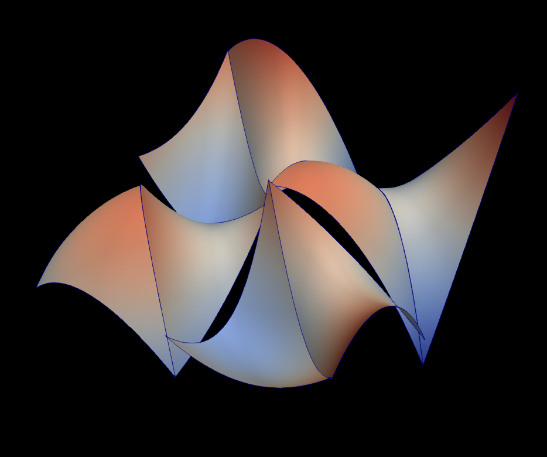
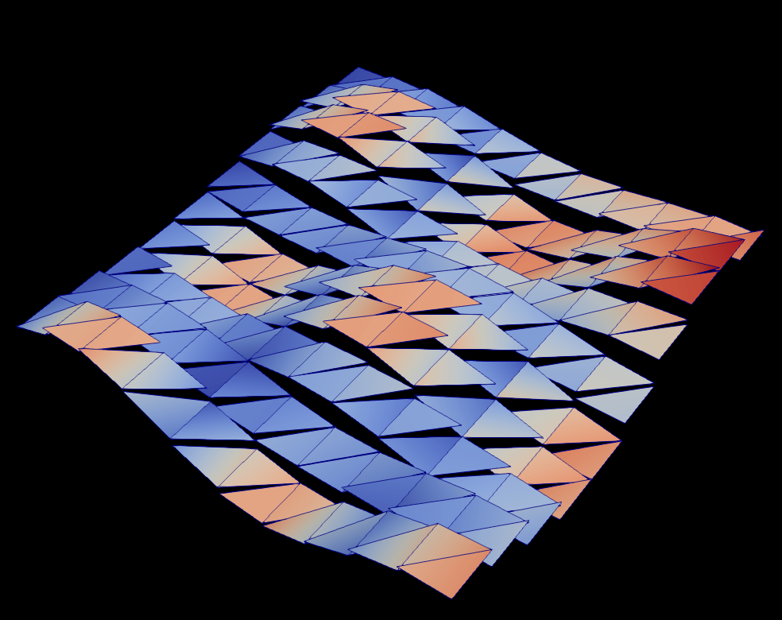
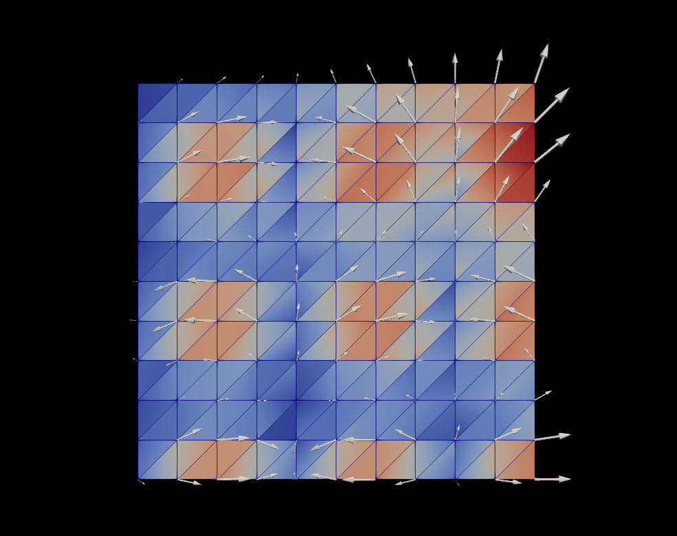

# Develop XDMF format for visualisation and checkpointing

This is a summary of my work done during summer 2017 as a part of my Google Summer of Code project. The project is mostly related to the finite element library FEniCS (www.fenicsproject.org) and XDMF file format (www.xdmf.org).

The work done could be divided into contributions to these three open-source codes:
*  DOLFIN (as a C++ layer of FEniCS), https://bitbucket.org/fenics-project/dolfin/,
*  XDMF file format and XDMF C++ library, https://gitlab.kitware.com/xdmf/xdmf,
*  VTK C++ library, https://gitlab.kitware.com/vtk/vtk.

#### DOLFIN contribution

* (Merged) pull request https://bitbucket.org/fenics-project/dolfin/pull-requests/367,
* (Open) pull request https://bitbucket.org/fenics-project/dolfin/pull-requests/387

  Detailed description of pull request could be found in the links. In summary they add new methods for IO of a finite element function. The data model is based on what was in DOLFIN already existing under pure HDF5 file format. 

#### XDMF contribution

* (Merged) merge request https://gitlab.kitware.com/xdmf/xdmf/merge_requests/41,
* XDMF wiki updated, my contributions to the wiki are in http://www.xdmf.org/index.php/Special:Contributions/Michal

  This adds new features to the XDMF specification. `Attribute` with `ItemType="FiniteElementFunction"` 
  and `ElementFamily`, `ElementDegree`, `ElementCell` is added. It changes C++ library also, but without interpretation of the data, i.e. only getters and setters are appended.
  
#### VTK contribution

* (Open) merge request https://gitlab.kitware.com/vtk/vtk/merge_requests/3194

  ParaView imports VTK library and it translates all XDMF data to VTK data format in a specific code path. This merge request adds the necessary logic to interpret new `FiniteElementFunction` Attribute. It understands what `ElementFamily`, `ElementDegree` and `ElementCell` in XDMF actually means and it knows how to prepare VTK data from it.
  
### Gallery

The FEniCS code, which does a finite element algebra and produces exemplary test functions could be found at https://github.com/michalhabera/xdmf-fe-filter/blob/michal/xdmf-new-format/generate.py. The data it produces are available here https://github.com/michalhabera/xdmf-fe-filter/tree/michal/xdmf-new-format/generated_files. With my contributions you can read and visualize any of the exemplary files. 

For clarity, let me show some examples of new functionality introduced by this project.

In Python interface to FEniCS you can write
```python
import dolfin as d

mesh = d.UnitSquareMesh(2, 2)
V = d.FunctionSpace(mesh, "DG", 2)

u = d.project(d.Expression("sin(8*x[0])*cos(8*x[1])", degree=5), V)

with d.XDMFFile("result1.xdmf") as file:
  file.write_checkpoint(u, "u", 0)
```

This writes `result.xdmf` light-data and `result.h5` heavy-data files. These can be visualized in ParaView thanks to my contribution and gives the following picture



Apart from `CG` and `DG` spaces on triangles, tetrahedra, quadrulaterals and hexahedra, non-trivial function space Raviart-Thomas of order 1 (FEniCS notation, in mathematics it is usually called degree 0) could be visualized.
The FEniCS code
```python
import dolfin as d

mesh = d.UnitSquareMesh(10, 10)
V = d.FunctionSpace(mesh, "RT", 1)

u = d.project(d.Expression(("sin(8*x[0])*cos(8*x[1])", "x[0]*x[1]"), degree=5), V)

with d.XDMFFile("result2.xdmf") as file:
  file.write_checkpoint(u, "u", 0)
```
produces a function, which has continuous normal components over edges of triangles. 
Normal component is the same as X-component for some edges and its continuity is clearly visible 



Glyphs for such vector space shown on its magnitude looks like



### GSoC blog

You can have a look at my progress in chronological order as captured in my blog, http://karlin.mff.cuni.cz/~habera/?p=gsoc17

### Future work

* Higher-order elements (degree > 2) are not implemented in VTK. My code interpolates such functions to the linear elements and plots them instead. More accurate approximation is possible with tesselation of element into linear subelements.
* DOLFIN XDMF IO data format stores 4 data arrays, but VTK and XDMF visualization takes into account only first two of them. The last two array which contain number of degrees of freedom in cell and cell ordering is not needed for uniform (with respect to degree) elements. We should get rid of this redundancy in DOLFIN.
* More finite element families could be implemented, `Crouzeix-Raviart`, `Brezzi-Douglas-Marini`, etc.
* Reading a DOLFIN function assumes full knowledge of a FunctionSpace where the function lives. From a user point of view this is too restrictive and there are possibilities how this could be simplified.
* One of the stored arrays, the array containing so-called degrees of freedom mapping, usually repeats when time series of a functions from the same space is stored. This produces redundant data. There is a space for optimization.
